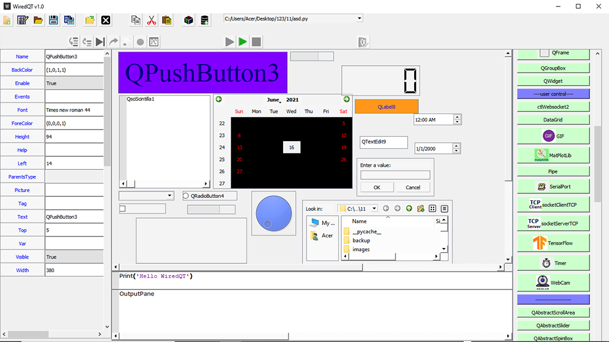

# Rapid Application Development (RAD) Tools for Python GUI Development

WiredQT is a Rapid Application Development (RAD) Tool for Python GUI Development is a reliable python powered program that will give its user advantage in machine learning, IoT systems, embedded systems, and many more!

- Create your own system
- Make some scripts
- Deploy!

## Getting Started

### What is WiredQt?

It is a compact Rapid Application Development Software designed to make system automation and prototypes in minutes - removing the need to worry about some software subscription.

### Features

You need machine learning using Tensorflow 2.0? We got you covered.

No MatLab? No problem.

   #### Version 1.00
In this version, you will be able to access the ff. (list may be incomplete);

- GIF animation
- Flask web framework
- DataGrid
- WebSocket
- Keypad
- Liquid crystal
- Serial Port
- Multiple tabulated windows
- Transmission Control Protocol for both Client and Server
- MatPlotLib
- Machine Learning using Tensorflow 2.0, see image below

### Windows Installation

1. RAD Tools for Python GUI Development requires Python3.7 to run and uses a number of python 3.7 dependencies to work properly:

        
        pip install PyQt5
        pip install QScintilla
        pip install parso==0.8.2
        pip install jedi==0.18.0
        pip install flask==1.0.4
        pip install pyserial
        pip install requests
        pip install pandas
        pip install pillow
        pip install opencv_python-4.5.2-cp37-cp37m-win32.whl		#from wheel search internet
        pip install pip install opencv-contrib-python
        pip install tensorflow==2.0					#if 64bit system

2. Compress and download the whole WiredQt folder.
3. Extract only the WiredQt folder to your root directory, like so
    
        C:\WiredQt

4. Edit the batch file [WiredQT.bat] in your preferred text editor, depending on which directory you want to place python37 and WiredQt for ease of access. In my case, it is;

        path=c:\python37
        python WiredQT.py
        
5. And, you're good to go! Yay!

      > Note: Make sure that Python37 is in the same directory as your WiredQT folder.
      ***For ease of use, you may download Python37 with added dependencies on this google drive link: [Python37 Google Drive](https://drive.google.com/file/d/1-QKWjbWvoe6L4I3DzGOqu-0Z-jjApl0V/view?usp=sharing)***

## Error Reporting

If you found some bugs (which there might be some) you can write in complete detail the bugs you've found in [issues](https://github.com/chiptrontech/WiredQTv1.0/issues/new). Bugs found must be reproducible, and by providing us how to reproduce the issue will only get the bugs you've found fixed.

## Development

Wish to contribute? Awesome! We shall release tutorials as part of future development on how to contribute as our wiki page is still on the works.

## License

Rapid Application Development (RAD) Tools for Python GUI Development
is now licensed under the [MIT License](LICENSE).
